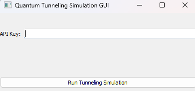

# Quantum Computers

Custom interface to communicate with IBM's opensource quantum computers.

<<<<<<< HEAD

=======

>>>>>>> c7e646b9cfc0cdc7fdac5d9d9d80e33d86a6b465

It allows to simulate a game, where a particle has to pass through a barrier and the probability is calculated in a quantum computer, emmulating quantum tunneling effects.
