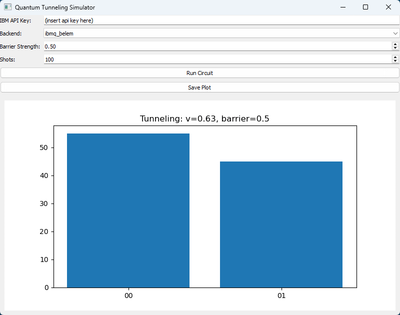

# Quantum Computers

Custom interface to communicate with IBM's opensource quantum computers.

It allows to simulate a game, where a particle has to pass through a barrier and the probability is calculated in a quantum computer, emmulating quantum tunneling effects.

More information can be seen on qiskit's official textbook: https://qiskit.org/textbook/preface.html or in their youtube channel.